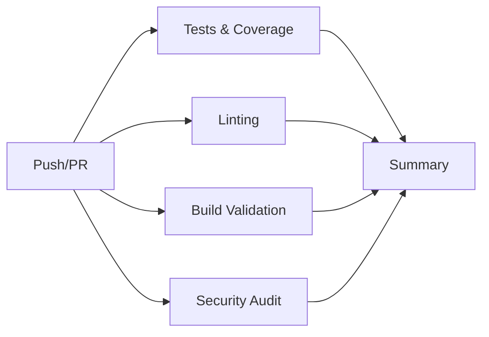

# 🚀 CI/CD Pipeline Configuration

## 📋 Overview

This document describes the Continuous Integration/Continuous Deployment (CI/CD) pipeline configuration for the Swift App project.

---

## 🏗️ Pipeline Architecture

### Pipeline Stages



### Jobs Overview

| Job | Purpose | Duration | Blocking |
|-----|---------|----------|----------|
| 🧪 **Tests & Coverage** | Run 321 tests, generate coverage | ~30s | ✅ Yes |
| 🔍 **Lint & Code Quality** | ESLint + Prettier checks | ~15s | ⚠️ Warning |
| 🏗️ **Build Validation** | TypeScript compilation | ~20s | ✅ Yes |
| 🔒 **Security Audit** | npm audit for vulnerabilities | ~10s | ⚠️ Warning |
| 📊 **Pipeline Summary** | Aggregate results | ~5s | ❌ No |

**Total Pipeline Time:** ~1-2 minutes

---

## 🧪 Test Job Details

### Matrix Strategy
- **Node Versions:** 18.x, 20.x
- **OS:** Ubuntu Latest
- **Parallel Execution:** Yes

### Steps
1. ✅ Checkout code
2. ✅ Setup Node.js (with npm cache)
3. ✅ Install dependencies (`npm ci`)
4. ✅ TypeScript compiler check
5. ✅ Run all tests with coverage
6. ✅ Generate coverage report
7. ✅ Upload to Codecov (Node 20.x only)
8. ✅ Save coverage artifacts

### Coverage Requirements
- **Target:** 100% (321/321 tests)
- **Upload:** Codecov with retention
- **Artifacts:** 30 days retention

---

## 🔍 Lint Job Details

### Checks Performed
- ✅ ESLint validation
- ✅ Prettier formatting check
- ⚠️ Non-blocking (warnings only)

### Configuration Files
- `.eslintrc.js` or `eslint.config.js`
- `.prettierrc` (optional)

---

## 🏗️ Build Job Details

### Validation Steps
1. ✅ TypeScript compilation (`tsc --noEmit`)
2. ✅ Expo project structure check
3. ✅ Dependencies installation
4. ✅ Build summary generation

### Success Criteria
- TypeScript compiles without errors
- All required project files present
- No missing dependencies

---

## 🔒 Security Job Details

### Security Checks
- ✅ `npm audit --audit-level=high`
- ⚠️ Non-blocking (warnings only)

### Vulnerability Levels
- **Critical/High:** Reported but non-blocking
- **Moderate/Low:** Logged for review

---

## 📊 Coverage Reporting

### Codecov Integration

**Setup Required:**
1. Create account at [codecov.io](https://codecov.io)
2. Add repository to Codecov
3. Get upload token
4. Add as GitHub secret: `CODECOV_TOKEN`

**Badge:**
```markdown
[](https://codecov.io/gh/slashforyou/swift-app)
```

### Coverage Artifacts
- **Location:** `coverage/` directory
- **Retention:** 30 days
- **Formats:** HTML report, lcov.info, JSON

---

## 🎯 Trigger Conditions

### Automatic Triggers

```yaml
on:
  push:
    branches: [ main, develop ]
  pull_request:
    branches: [ main, develop ]
```

**When Pipeline Runs:**
- ✅ Push to `main` branch
- ✅ Push to `develop` branch
- ✅ Pull Request to `main`
- ✅ Pull Request to `develop`

---

## 🚨 Required GitHub Secrets

| Secret Name | Purpose | Required |
|-------------|---------|----------|
| `CODECOV_TOKEN` | Upload coverage reports | ⚠️ Optional |

### Adding Secrets
1. Go to GitHub repo → Settings → Secrets
2. Click "New repository secret"
3. Add `CODECOV_TOKEN` with token from Codecov

---

## 🛡️ Branch Protection Rules

### Recommended Settings

**For `main` branch:**
- ✅ Require pull request reviews (1 reviewer)
- ✅ Require status checks to pass:
  - `test` (required)
  - `build` (required)
  - `lint` (optional)
  - `security` (optional)
- ✅ Require branches to be up to date
- ✅ Include administrators
- ❌ Allow force pushes: No
- ❌ Allow deletions: No

**For `develop` branch:**
- ✅ Require status checks to pass:
  - `test` (required)
  - `build` (required)
- ⚠️ Less strict than `main`

### Setup Instructions
1. Go to Settings → Branches
2. Add rule for `main`
3. Configure settings above
4. Save changes

---

## 📈 Performance Optimization

### Cache Strategy
```yaml
- uses: actions/setup-node@v4
  with:
    cache: 'npm'
```

**Benefits:**
- ⚡ Faster dependency installation
- 💾 Reduced bandwidth usage
- 🚀 Quicker pipeline execution

### Parallel Execution
- **Matrix builds:** Node 18.x & 20.x run in parallel
- **Test workers:** `--maxWorkers=2` for stability
- **Job parallelization:** All 5 jobs run simultaneously

---

## 🎨 Status Badges

### GitHub Actions Badge
```markdown
[](https://github.com/slashforyou/swift-app/actions/workflows/ci.yml)
```

### Test Coverage Badge
```markdown
[](https://codecov.io/gh/slashforyou/swift-app)
```

### All Badges Combined
```markdown


```

---

## 🔧 Troubleshooting

### Common Issues

**Issue 1: Tests timeout**
```yaml
# Solution: Increase timeout
- run: npm test -- --testTimeout=30000
```

**Issue 2: Out of memory**
```yaml
# Solution: Reduce max workers
- run: npm test -- --maxWorkers=2
```

**Issue 3: Cache issues**
```yaml
# Solution: Clear cache
- run: npm ci --cache .npm --prefer-offline
```

---

## 📝 Pipeline Maintenance

### Weekly Tasks
- [ ] Review security audit results
- [ ] Check for outdated dependencies
- [ ] Monitor pipeline duration trends

### Monthly Tasks
- [ ] Update Node.js versions in matrix
- [ ] Review and update GitHub Actions versions
- [ ] Clean up old workflow runs

### Quarterly Tasks
- [ ] Review and optimize pipeline configuration
- [ ] Update documentation
- [ ] Evaluate new CI/CD tools

---

## 🎯 Success Metrics

### Target KPIs
- **Pipeline Success Rate:** >95%
- **Average Duration:** <2 minutes
- **Test Coverage:** 100% (maintained)
- **Security Vulnerabilities:** 0 high/critical

### Monitoring
- GitHub Actions dashboard
- Codecov analytics
- Weekly automated reports

---

## 📚 Resources

- [GitHub Actions Documentation](https://docs.github.com/en/actions)
- [Codecov Documentation](https://docs.codecov.com)
- [Jest Coverage](https://jestjs.io/docs/configuration#collectcoverage-boolean)
- [TypeScript Compiler Options](https://www.typescriptlang.org/tsconfig)

---

**Last Updated:** October 26, 2025  
**Version:** 1.0.0  
**Status:** ✅ Active
