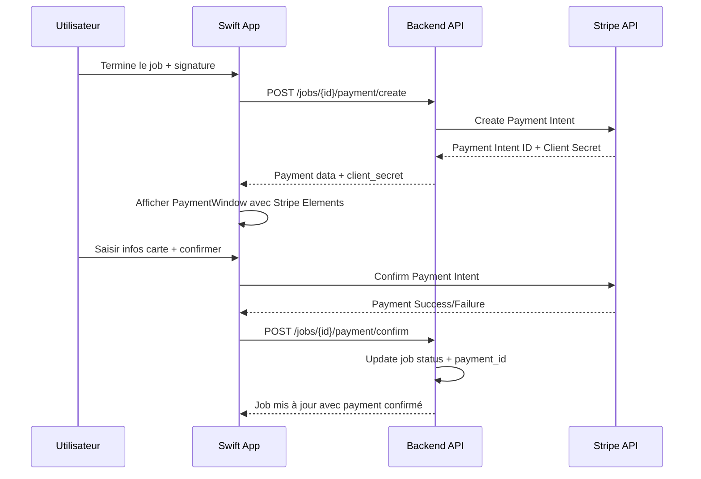

# 📋 PLAN D'INTÉGRATION - SYSTÈME DE PAIEMENT STRIPE POUR LES JOBS

## 🎯 OBJECTIF PRINCIPAL
Intégrer le système de paiement Stripe Connect aux jobs pour permettre aux utilisateurs de traiter les paiements directement dans l'application, en remplacement du système de simulation actuel.

---

## 🔍 ÉTAT ACTUEL - ANALYSE

### ✅ CE QUI FONCTIONNE DÉJÀ
1. **Stripe Connect Configuré** ✅
   - Compte connecté : `acct_1SV8KSIsgSU2xbML` (ACTIVE)
   - Company ID 1 (Nerd-Test) mappé à User ID 15 (Romain)
   - Endpoints backend opérationnels : `/v1/stripe/connect/status`, `/v1/stripe/balance`, etc.

2. **Interface de Paiement Existante** ✅
   - `PaymentScreen` : Interface complète avec calculs temps réel
   - `PaymentWindow` : Modal de saisie carte/espèces avec validation
   - Timer intégré avec `useJobTimerContext` pour coûts dynamiques
   - Signature requise avant paiement

3. **Services Stripe Opérationnels** ✅
   - `StripeService.ts` : Toutes les fonctions API connectées
   - Hooks React : `useStripeAccount`, `useStripePayments`, etc.
   - Récupération réelle des données Stripe (balance, comptes, etc.)

### ⚠️ LIMITATIONS ACTUELLES
1. **Simulation de Paiement** ⚠️
   - `PaymentWindow` utilise `setTimeout()` pour simuler les transactions
   - Aucune interaction réelle avec Stripe Payment Intents
   - Données job mises à jour localement seulement

2. **Manque d'Endpoints Paiement Job** ❌
   - Pas d'API pour créer des Payment Intents liés aux jobs
   - Pas de persistance des transactions job ↔ Stripe
   - Pas de webhook pour confirmer les paiements

3. **Architecture Job-Paiement** ❌
   - Pas de lien entre Job ID et Stripe Payment Intent
   - Pas de sauvegarde backend des statuts de paiement job

---

## 📊 ARCHITECTURE PROPOSÉE

### 🎯 FLUX DE PAIEMENT JOB INTÉGRÉ



### 🏗️ NOUVEAUX ENDPOINTS REQUIS

#### 1. Création Payment Intent pour Job
```
POST /v1/jobs/{job_id}/payment/create
Body: {
  "amount": 125.50,
  "currency": "AUD",
  "description": "Job #J-001234 - Plumbing repair"
}
Response: {
  "success": true,
  "data": {
    "payment_intent_id": "pi_xxx",
    "client_secret": "pi_xxx_secret_xxx",
    "amount": 12550,
    "currency": "aud"
  }
}
```

#### 2. Confirmation Payment pour Job
```
POST /v1/jobs/{job_id}/payment/confirm
Body: {
  "payment_intent_id": "pi_xxx",
  "status": "succeeded|failed"
}
Response: {
  "success": true,
  "data": {
    "job": { /* job mis à jour avec payment_id */ },
    "payment_status": "paid"
  }
}
```

#### 3. Historique Paiements Job
```
GET /v1/jobs/{job_id}/payments
Response: {
  "success": true,
  "data": [
    {
      "id": "pi_xxx",
      "amount": 12550,
      "status": "succeeded",
      "created": "2025-12-07T10:30:00Z",
      "method": "card_visa_4242"
    }
  ]
}
```

---

## 📋 PLAN D'IMPLÉMENTATION

### 🚀 PHASE 1 - BACKEND API (2-3h)
**Priorité: CRITIQUE** 
*L'équipe backend doit créer les endpoints job-payment*

#### 1.1 Endpoints de Base
- [ ] `POST /v1/jobs/{job_id}/payment/create` - Création Payment Intent
- [ ] `POST /v1/jobs/{job_id}/payment/confirm` - Confirmation paiement
- [ ] `GET /v1/jobs/{job_id}/payments` - Historique paiements job

#### 1.2 Modèle de Données
- [ ] Table `job_payments` avec colonnes :
  - `job_id`, `stripe_payment_intent_id`, `amount`, `currency`, `status`, `created_at`
- [ ] Mise à jour table `jobs` avec `payment_status` et `total_paid`

#### 1.3 Intégration Stripe
- [ ] Utiliser Stripe SDK côté backend pour Payment Intents
- [ ] Webhooks Stripe pour confirmer les paiements asynchrones

### 🎨 PHASE 2 - FRONTEND INTÉGRATION (1-2h)
**Priorité: HAUTE**

#### 2.1 Services API Job-Payment
- [ ] Créer `JobPaymentService.ts` avec fonctions :
  - `createJobPaymentIntent(jobId, amount, description)`
  - `confirmJobPayment(jobId, paymentIntentId, status)`
  - `getJobPaymentHistory(jobId)`

#### 2.2 Hook de Gestion Paiement Job
- [ ] Créer `useJobPayment.ts` hook :
  - État : `{ paymentIntent, loading, error, paymentStatus }`
  - Fonctions : `createPayment()`, `confirmPayment()`, `getHistory()`

#### 2.3 Intégration PaymentWindow
- [ ] Remplacer simulation `setTimeout()` par vrai Stripe Payment Intent
- [ ] Utiliser `@stripe/stripe-react-native` pour saisie carte sécurisée
- [ ] Gérer les états : création → saisie → confirmation → succès/échec

### 🔧 PHASE 3 - AMÉLIORATION UX (1h)
**Priorité: MOYENNE**

#### 3.1 Feedback Utilisateur
- [ ] Loading states pendant création Payment Intent
- [ ] Messages d'erreur spécifiques (carte refusée, etc.)
- [ ] Écran de succès avec détails transaction

#### 3.2 Historique et Reçus
- [ ] Section "Paiements" dans JobDetails
- [ ] Génération de reçus PDF (optionnel)
- [ ] Export des données pour comptabilité

### 🧪 PHASE 4 - TESTS ET VALIDATION (1h)
**Priorité: HAUTE**

#### 4.1 Tests d'Intégration
- [ ] Test complet : Job terminé → Paiement → Confirmation backend
- [ ] Test des cas d'erreur : carte refusée, timeout, erreur réseau
- [ ] Test de la cohérence des données job ↔ Stripe

#### 4.2 Tests Utilisateur
- [ ] Workflow complet avec carte de test Stripe
- [ ] Vérification des montants et devises
- [ ] Test de la synchronisation des statuts

---

## ⚠️ POINTS D'ATTENTION

### 🔐 SÉCURITÉ
- **JAMAIS stocker les détails de carte côté frontend**
- Utiliser Stripe Elements ou Payment Sheet pour saisie sécurisée
- Validation backend obligatoire avant confirmation paiement

### 💰 GESTION DES MONTANTS
- Tous les montants en centimes pour éviter erreurs arrondis
- Vérification côté backend : montant Payment Intent = coût job calculé
- Gestion des taxes (GST) selon législation australienne

### 🔄 GESTION D'ÉTAT
- Synchronisation état job local ↔ backend après paiement
- Gestion des timeouts et reconnexions réseau
- Rollback en cas d'échec de confirmation

### 📱 UX MOBILE
- Interface Payment optimisée pour mobile (React Native)
- Gestion du clavier et focus sur champs carte
- Support des lecteurs de cartes externes (optionnel)

---

## 🎯 RÉSULTAT ATTENDU

### ✅ FONCTIONNALITÉS FINALES
1. **Paiement Job Intégré** : Transaction Stripe réelle liée au job
2. **Persistance Données** : Paiements sauvés backend avec lien job ↔ Stripe
3. **UX Seamless** : Interface moderne sans quitter l'app
4. **Traçabilité** : Historique complet des transactions par job

### 📈 MÉTRIQUES DE SUCCÈS
- Taux de conversion paiement > 95%
- Temps moyen de transaction < 30 secondes
- Zéro erreur de synchronisation job ↔ payment
- Interface utilisateur intuitive sans friction

---

## 🚦 NEXT STEPS

### 1. **VALIDATION DU PLAN** ⏳
- [ ] Review de ce document
- [ ] Validation de l'architecture proposée
- [ ] Priorisation des phases

### 2. **COORDINATION BACKEND** 🤝
- [ ] Brief équipe backend sur les endpoints requis
- [ ] Définition des contrats API détaillés
- [ ] Planning de développement backend

### 3. **DÉMARRAGE PHASE 1** 🚀
- [ ] Création des endpoints backend
- [ ] Tests d'intégration API ↔ Stripe
- [ ] Documentation API pour frontend

---

**💡 Ce plan assure une intégration complète et sécurisée du paiement Stripe dans le workflow job, en remplaçant les simulations par de véritables transactions financières.**