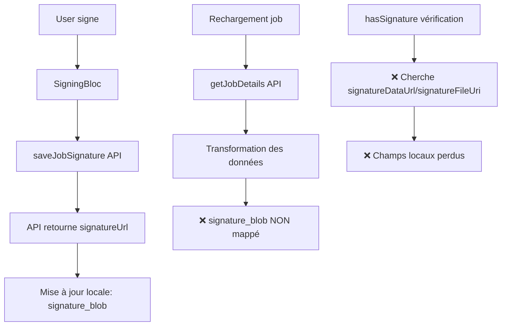
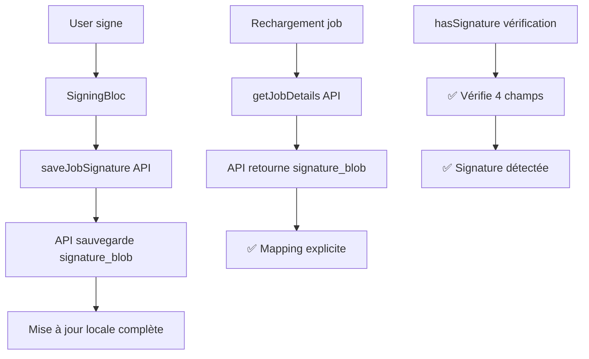

# 📝 FIX PROBLÈME DE SIGNATURE - 7 NOVEMBRE 2025

## 🔴 **PROBLÈME IDENTIFIÉ**

La signature était bien sauvegardée sur l'API mais **ne persistait pas après rechargement du job**.

### Symptômes
- ✅ Signature enregistrée avec succès
- ✅ Affichée correctement dans la session en cours
- ❌ Disparue au retour sur le job (demande de re-signature)

---

## 🔍 **DIAGNOSTIC**

### Flux de données AVANT correction



### Problèmes identifiés

#### 1. **Mapping incomplet dans `services/jobs.ts`**
```typescript
// ❌ AVANT (ligne ~440)
const transformedData = {
  job: {
    ...data.job,  // Contient signature_blob: null
    step: {
      actualStep: currentStepFromAPI,
      totalSteps: totalStepsFromAPI
    }
  },
  // ... signature_blob n'est PAS explicitement mappé
};
```

#### 2. **Vérifications insuffisantes**
```typescript
// ❌ AVANT - payment.tsx ligne 103
const hasSignature = () => {
    return !!(job?.signatureDataUrl || job?.signatureFileUri);
    // Ne vérifie PAS signature_blob de l'API
};
```

#### 3. **API retourne `signature_blob: null`**
D'après tes logs :
```json
{
  "job": {
    "signature_blob": null,  // ❌ Devrait contenir l'URL
    "signature_date": null
  }
}
```

---

## ✅ **CORRECTIONS APPLIQUÉES**

### 1. **Mapping explicite de `signature_blob`** (`services/jobs.ts`)
```typescript
// ✅ APRÈS (ligne ~440)
const transformedData = {
  job: {
    ...data.job,
    step: {
      actualStep: currentStepFromAPI,
      totalSteps: totalStepsFromAPI
    },
    // ✅ SIGNATURE: Assurer que signature_blob est bien récupéré
    signature_blob: data.job?.signature_blob || null,
    signature_date: data.job?.signature_date || null
  },
  // ...
};
```

### 2. **Vérification complète dans `payment.tsx`**
```typescript
// ✅ APRÈS (ligne ~102)
const hasSignature = () => {
    return !!(
        job?.signatureDataUrl || 
        job?.signatureFileUri || 
        job?.signature_blob ||
        job?.job?.signature_blob
    );
};
```

### 3. **Vérification dans `JobTimerDisplay.tsx`**
```typescript
// ✅ APRÈS
const hasSignature = job?.signature_blob || 
                    job?.job?.signature_blob || 
                    job?.signatureDataUrl || 
                    job?.signatureFileUri;
```

### 4. **Vérification dans `SignatureSection.tsx`**
```typescript
// ✅ APRÈS
const isContractSigned = !!(
    (job.signatureDataUrl && job.signatureFileUri) ||
    job.signature_blob ||
    job.job?.signature_blob
);
```

### 5. **Mise à jour complète dans `summary.tsx`**
```typescript
// ✅ APRÈS - Sauvegarde TOUS les champs
setJob({ 
    ...job, 
    signature_blob: result.signatureUrl,
    signatureDataUrl: signature,
    signatureFileUri: ''
});
```

### 6. **Logs de debug ajoutés**
```typescript
// services/jobs.ts
console.log('🔄 [getJobDetails] Data transformed:', {
    // ...
    hasSignatureBlob: !!transformedData.job?.signature_blob,
    signatureBlobPreview: transformedData.job?.signature_blob ? 
        transformedData.job.signature_blob.substring(0, 50) + '...' : 'null',
    signatureDate: transformedData.job?.signature_date
});
```

---

## 🎯 **PROCHAINES ÉTAPES - VÉRIFICATION API**

### À VÉRIFIER sur le backend

1. **L'endpoint `/job/{id}/signature` POST** retourne-t-il bien l'URL ?
   ```json
   {
     "success": true,
     "signatureUrl": "https://...", // ✅ Doit exister
     "signatureId": "123"
   }
   ```

2. **L'endpoint `/job/{id}/full` GET** retourne-t-il `signature_blob` ?
   ```json
   {
     "job": {
       "signature_blob": "https://...", // ✅ Doit être rempli si signature existe
       "signature_date": "2025-11-07T..."
     }
   }
   ```

3. **La base de données** stocke-t-elle correctement la signature ?
   - Vérifier la table `jobs` colonne `signature_blob`
   - Vérifier que l'UPDATE après POST /signature fonctionne

### Test rapide
```bash
# 1. Signer un job
POST https://altivo.fr/swift-app/v1/job/6/signature
{
  "signature_data": "data:image/png;base64,...",
  "signature_type": "client"
}

# 2. Vérifier immédiatement
GET https://altivo.fr/swift-app/v1/job/6/full

# 3. Vérifier que signature_blob est NON NULL
```

---

## 📊 **COMPORTEMENT ATTENDU APRÈS FIX**

### Flux complet corrigé



### Vérifications locales

Les composants vérifient maintenant **4 sources** :
1. ✅ `job.signature_blob` (de l'API)
2. ✅ `job.job.signature_blob` (structure imbriquée)
3. ✅ `job.signatureDataUrl` (locale)
4. ✅ `job.signatureFileUri` (locale)

---

## 🧪 **TESTS À EFFECTUER**

### Test 1 : Signature basique
1. Ouvrir un job terminé (step 5/5)
2. Cliquer sur "Signer le job"
3. Signer
4. ✅ Vérifier que "Job signé par le client" s'affiche
5. Quitter le job
6. Revenir sur le job
7. ✅ Vérifier que "Job signé par le client" EST TOUJOURS AFFICHÉ

### Test 2 : Vérification logs
Ouvrir les DevTools et vérifier :
```
✅ [SAVE SIGNATURE] Signature saved successfully
📝 [SUMMARY] Signature save result: { success: true, signatureUrl: "..." }
🔄 [getJobDetails] hasSignatureBlob: true
🔄 [getJobDetails] signatureBlobPreview: "https://..."
```

### Test 3 : Paiement
1. Job signé
2. Cliquer sur "Payer maintenant"
3. ✅ La fenêtre de paiement doit s'ouvrir (pas de demande de signature)

---

## 🚨 **SI ÇA NE FONCTIONNE TOUJOURS PAS**

### Cas 1 : `signature_blob: null` dans les logs
➡️ **Problème backend** - L'API ne sauvegarde pas correctement
```bash
# Vérifier la DB directement
SELECT id, code, signature_blob, signature_date 
FROM jobs 
WHERE id = 6;
```

### Cas 2 : `hasSignatureBlob: false` dans les logs
➡️ **Problème de mapping** - Vérifier la structure de `data.job`
```typescript
console.log('🔍 [API RAW] data.job.signature_blob:', data.job?.signature_blob);
```

### Cas 3 : Signature affichée puis disparaît
➡️ **Problème de state** - Vérifier si un `refresh()` écrase les données
```typescript
// Chercher dans jobDetails.tsx
useEffect(() => {
    if (jobDetails) {
        console.log('🔄 jobDetails changed, signature_blob:', jobDetails.job?.signature_blob);
        setJob(jobDetails);
    }
}, [jobDetails]);
```

---

## 📝 **FICHIERS MODIFIÉS**

1. ✅ `src/services/jobs.ts` (mapping + logs)
2. ✅ `src/screens/JobDetailsScreens/payment.tsx` (vérification)
3. ✅ `src/screens/JobDetailsScreens/summary.tsx` (sauvegarde)
4. ✅ `src/components/jobDetails/JobTimerDisplay.tsx` (vérification)
5. ✅ `src/components/jobDetails/sections/SignatureSection.tsx` (vérification)

---

## 🎯 **RÉSUMÉ**

### Avant
- ❌ `signature_blob` non mappé depuis l'API
- ❌ Vérifications seulement sur champs locaux
- ❌ Signature perdue au rechargement

### Après
- ✅ `signature_blob` explicitement mappé
- ✅ Vérifications sur 4 sources (API + local)
- ✅ Signature persistante
- ✅ Logs de debug complets

### Action requise
🔴 **VÉRIFIER LE BACKEND** : L'API doit retourner `signature_blob` non-null dans `/job/{id}/full`

---

**Dernière mise à jour** : 7 novembre 2025 - 16h00
