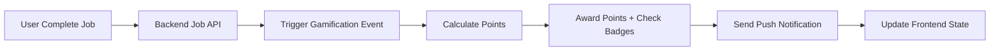
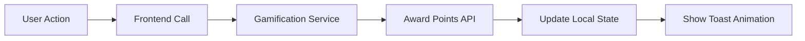

# 🎮 SwiftApp - Système de Gamification Complet

**Date**: 7 Décembre 2025  
**Version**: 1.0  
**Statut**: Spécification Technique - Prêt pour Implémentation

---

## 🎯 **Objectif Principal**

Augmenter l'engagement utilisateur et la fidélisation grâce à un système de gamification complet qui récompense toutes les bonnes actions dans l'app.

**KPIs Cibles** :
- +40% engagement utilisateur mensuel
- +25% rétention à 30 jours  
- +60% completion rate des profils
- +35% jobs terminés avec qualité maximale

---

## 🏆 **Actions Récompensées Identifiées**

### 📊 **Jobs & Productivité** (Points Majeurs)

| Action | Points | Fréquence | Notes |
|---------|--------|-----------|--------|
| **Compléter un job** | +50 | Par job | Bonus selon durée/complexité |
| **Finir un job en avance** | +25 | Par job | Si < 90% temps estimé |
| **Job avec 0 réclamation client** | +30 | Par job | Évalué 48h après |
| **Démarrer job à l'heure pile** | +10 | Par job | Dans fenêtre ±5min |
| **Upload photos complètes** | +15 | Par job | Toutes les étapes documentées |
| **Job facturé rapidement** | +20 | Par job | Si facturé < 24h après completion |
| **Encaisser paiement immédiat** | +15 | Par job | Cash/card payment direct |

### 👥 **Management & Staff** (Points Collaboration)

| Action | Points | Fréquence | Notes |
|---------|--------|-----------|--------|
| **Créer équipe complète** | +100 | Par équipe | Minimum 3 membres actifs |
| **Former nouveau staff** | +75 | Par personne | Compléter onboarding |
| **Équipe sans incident 1 mois** | +200 | Mensuel | Bonus leader d'équipe |
| **Évaluation staff positive** | +25 | Par évaluation | Note ≥ 4/5 |
| **Résoudre conflit équipe** | +50 | Par incident | Marqué résolu + feedback |

### 💼 **Business & Profil** (Points Professionnalisation)

| Action | Points | Fréquence | Notes |
|---------|--------|-----------|--------|
| **Compléter profil 100%** | +150 | Une fois | Toutes sections remplies |
| **Ajouter véhicule vérifié** | +40 | Par véhicule | Avec docs validés |
| **Première connexion mensuelle** | +20 | Mensuel | Maintenir l'activité |
| **Utiliser app 7 jours consécutifs** | +80 | Par semaine | Streak bonus |
| **Mettre à jour infos business** | +25 | Trimestriel | Maintenir données à jour |
| **Ajouter assurances à jour** | +60 | Annuel | Documents validés |

### 💰 **Finances & Paiements** (Points Gestion)

| Action | Points | Fréquence | Notes |
|---------|--------|-----------|--------|
| **Paiement immédiat reçu** | +10 | Par transaction | Stripe direct |
| **Facture envoyée rapidement** | +15 | Par job | < 6h après completion |
| **Mois sans retard paiement** | +100 | Mensuel | Tous clients payés |
| **Configurer auto-facturation** | +50 | Une fois | Setup Stripe récurrent |
| **Atteindre objectif mensuel** | +300 | Mensuel | CA défini par utilisateur |

### 📱 **Utilisation App & Innovation** (Points Engagement)

| Action | Points | Fréquence | Notes |
|---------|--------|-----------|--------|
| **Tester nouvelle fonctionnalité** | +30 | Par feature | Beta testing |
| **Feedback app constructif** | +40 | Illimité | Si feedback utile |
| **Partager app à un professionnel** | +100 | Par référence | Si inscription confirmée |
| **Utiliser timer précisément** | +5 | Par job | Si écart < 5% estimé |
| **Compléter module formation** | +60 | Par module | Formation continue |

---

## 🎖️ **Système de Niveaux & Badges**

### **Niveaux d'Expérience**

```typescript
interface UserLevel {
  level: number;
  title: string;
  experienceRequired: number;
  benefits: string[];
  icon: string;
}

const LEVELS: UserLevel[] = [
  { level: 1, title: "Novice", experienceRequired: 0, benefits: ["Accès basique"], icon: "🌱" },
  { level: 2, title: "Apprenti", experienceRequired: 500, benefits: ["Dashboard amélioré"], icon: "🔰" },
  { level: 3, title: "Professionnel", experienceRequired: 1500, benefits: ["Analytics avancées"], icon: "⚡" },
  { level: 4, title: "Expert", experienceRequired: 3500, benefits: ["Priority support"], icon: "🏆" },
  { level: 5, title: "Maître", experienceRequired: 7500, benefits: ["Features beta"], icon: "👑" },
  { level: 6, title: "Légendaire", experienceRequired: 15000, benefits: ["Custom branding"], icon: "💎" },
  { level: 7, title: "Champion", experienceRequired: 30000, benefits: ["Revenue sharing"], icon: "🚀" }
];
```

### **Badges de Réalisation**

```typescript
interface Badge {
  id: string;
  name: string;
  description: string;
  icon: string;
  rarity: 'common' | 'rare' | 'epic' | 'legendary';
  requirements: BadgeRequirement[];
  rewards: BadgeReward[];
}

const BADGES = {
  // Performance
  PERFECTIONIST: { name: "Perfectionniste", description: "100 jobs sans réclamation", icon: "🎯" },
  SPEED_DEMON: { name: "Éclair", description: "50 jobs finis en avance", icon: "⚡" },
  RELIABLE: { name: "Fiable", description: "6 mois sans retard", icon: "🕐" },
  
  // Leadership  
  TEAM_BUILDER: { name: "Bâtisseur d'équipe", description: "Créer 5 équipes actives", icon: "👥" },
  MENTOR: { name: "Mentor", description: "Former 10 nouveaux membres", icon: "🎓" },
  
  // Business
  ENTREPRENEUR: { name: "Entrepreneur", description: "€50K CA annuel", icon: "💼" },
  GROWTH_HACKER: { name: "Growth Hacker", description: "10 références actives", icon: "📈" },
  
  // Innovation
  BETA_TESTER: { name: "Pionnier", description: "Tester 20 nouvelles features", icon: "🧪" },
  CONTRIBUTOR: { name: "Contributeur", description: "50 feedbacks acceptés", icon: "💡" }
};
```

---

## 🏗️ **Architecture Technique**

### **Côté Serveur (Backend API Required)**

```typescript
// Nouvelles tables DB nécessaires
interface UserGamification {
  user_id: string;
  level: number;
  experience: number;
  total_points_earned: number;
  current_streak_days: number;
  longest_streak_days: number;
  badges_earned: string[]; // JSON array
  achievements: UserAchievement[];
  last_action_date: Date;
  monthly_targets: MonthlyTarget[];
  created_at: Date;
  updated_at: Date;
}

interface PointsTransaction {
  id: string;
  user_id: string;
  action_type: string;
  points_awarded: number;
  job_id?: string;
  staff_id?: string;
  description: string;
  metadata: any; // JSON pour données contextuelles
  created_at: Date;
}

interface UserAchievement {
  badge_id: string;
  earned_at: Date;
  progress?: number; // Pour badges progressifs
  metadata?: any;
}
```

### **Endpoints API Requis**

```typescript
// GET /api/v1/gamification/user/:userId/profile
// Retourne profil gamification complet

// POST /api/v1/gamification/points/award
// Award points pour une action (appelé depuis backend events)

// GET /api/v1/gamification/leaderboards
// Classements par période/catégorie

// GET /api/v1/gamification/badges/available
// Liste des badges et progression

// POST /api/v1/gamification/achievements/unlock
// Débloquer un achievement

// GET /api/v1/gamification/history/:userId
// Historique des points et actions
```

### **Côté Frontend (React Native)**

```typescript
// Hook principal
interface UseGamificationResult {
  profile: UserGamificationProfile;
  recentPoints: PointsTransaction[];
  availableBadges: Badge[];
  leaderboards: LeaderboardData[];
  isLoading: boolean;
  
  // Actions
  awardPoints: (action: string, metadata?: any) => Promise<void>;
  checkForNewBadges: () => Promise<Badge[]>;
  refreshProfile: () => Promise<void>;
}

// Service
class GamificationService {
  static async awardPoints(action: string, points: number, metadata: any): Promise<PointsTransaction>;
  static async getUserProfile(userId: string): Promise<UserGamificationProfile>;
  static async checkBadgeProgress(userId: string): Promise<Badge[]>;
  static async getLeaderboards(period: string): Promise<LeaderboardData[]>;
}

// Components
const GamificationWidget = ({ userId }) => {
  // Widget compact pour header app
};

const LevelProgressBar = ({ currentXP, nextLevelXP }) => {
  // Barre de progression niveau
};

const BadgeCollection = ({ badges }) => {
  // Collection de badges utilisateur
};

const PointsToast = ({ points, action }) => {
  // Toast animé "+50 XP - Job Completed!"
};
```

---

## 🔄 **Workflow d'Attribution des Points**

### **Automatique (Événements Backend)**



**Exemples d'événements automatiques** :
- Job completion
- Payment received
- Profile update
- Login streak
- Team formation
- Document validation

### **Manuel (Actions Utilisateur)**



**Exemples d'actions manuelles** :
- Feedback submission
- Beta feature testing
- Profile completion
- App sharing

---

## 🎨 **Interface Utilisateur**

### **Dashboard Gamification**

```
┌─────────────────────────────┐
│ 👑 Niveau 4 - Expert        │
│ ▓▓▓▓▓▓▓░░░ 2,847/3,500 XP  │
│                             │
│ 🏆 Badges Récents           │
│ [🎯] [⚡] [💼]              │
│                             │
│ 📊 Points Cette Semaine     │
│ +340 XP (↑15% vs semaine dernière) │
│                             │
│ 🎖️ Prochain Objectif        │
│ Perfectionniste: 87/100 jobs parfaits │
└─────────────────────────────┘
```

### **Toast Notifications Points**

```
┌─────────────────────────┐
│ +50 XP 🎉              │
│ Job Completed!         │
│ Niveau 4: 2,897/3,500  │
└─────────────────────────┘
```

### **Leaderboards**

```
🏆 Classement Mensuel

1. 👑 John Smith - 1,847 XP
2. 🥈 Marie Dubois - 1,502 XP  
3. 🥉 Paul Martin - 1,445 XP
...
15. 📍 Vous - 847 XP (+5 places!)
```

---

## 🚀 **Plan d'Implémentation**

### **Phase 1: Core System (2 semaines)**

1. **Backend Setup**
   - Tables gamification
   - API endpoints basiques
   - Points attribution automatique

2. **Frontend Base**
   - GamificationService
   - Hook useGamification
   - Widgets UI basiques

### **Phase 2: Advanced Features (2 semaines)**

1. **Badges System**
   - Logique de déblocage
   - Interface badges collection
   - Notifications push

2. **Leaderboards**
   - Classements temps réel
   - Filtres par équipe/région
   - Compétitions mensuelles

### **Phase 3: Gamification UX (1 semaine)**

1. **Animations & Polish**
   - Transitions fluides
   - Sound effects (optionnel)
   - Onboarding gamification

2. **Advanced Analytics**
   - Progression tracking
   - Performance insights
   - Recommandations personnalisées

---

## 💡 **Recommandations Stratégiques**

### **Équilibrage Points**

- **Start Easy** : Premiers niveaux rapides pour engagement
- **Meaningful Rewards** : Avantages concrets (pas que cosmétique)
- **Social Competition** : Leaderboards équipe vs individuel
- **Seasonal Events** : Bonus temporaires, défis spéciaux

### **Engagement Long Terme**

- **Daily Streaks** : Bonus connexion quotidienne
- **Weekly Challenges** : Objectifs changeants
- **Milestone Rewards** : Gros bonus aux niveaux clés
- **Referral Program** : Points pour recommandations

### **Éviter les Pièges**

- **Pas de P2W** : Aucun achat pour accélérer progression
- **Fair Play** : Détection anti-triche côté serveur
- **Flexible System** : Possibilité ajuster points/rewards
- **User Choice** : Option désactiver gamification

---

## 📈 **Métriques de Succès**

### **KPIs Engagement**
- Daily/Weekly/Monthly Active Users
- Retention Rate par niveau utilisateur
- Temps moyen dans l'app par session
- Nombre d'actions complétées par utilisateur

### **KPIs Business**
- Corrélation niveau utilisateur ↔ revenue
- Taux de completion des jobs
- Satisfaction client (reviews)
- Churn rate par segment gamification

### **KPIs Techniques**
- Performance API gamification
- Time to level up moyen
- Distribution des niveaux utilisateur
- Engagement rate par feature

---

## 🎯 **Conclusion**

Le système de gamification SwiftApp est conçu pour être :

✅ **Motivant** : Récompenses immédiates et progression visible  
✅ **Fair** : Tous les utilisateurs peuvent progresser  
✅ **Business-Aligned** : Récompense les bonnes pratiques business  
✅ **Scalable** : Architecture prête pour des millions d'utilisateurs  
✅ **Flexible** : Ajustements faciles des règles  

**Prêt pour développement immédiat !** 🚀